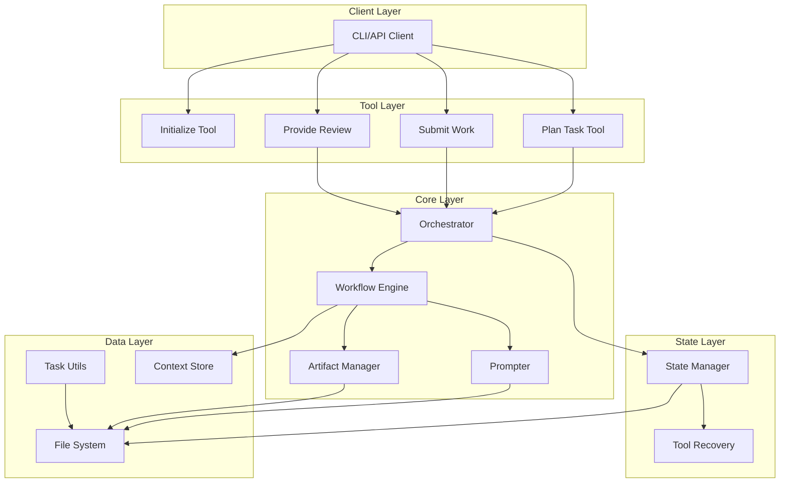

# Alfred Architecture Overview

## Introduction

Alfred is an AI-powered task management system built from the ground up with a clean architecture that emphasizes type safety, state management, and human-AI collaboration. The system currently consists of two primary tools: `initialize` and `plan_task`, with the architecture designed to be extensible for future tools.

## Core Design Principles

### 1. **Strongly-Typed Data Models**
Every data structure in Alfred is defined using Pydantic models, ensuring type safety and validation throughout the system:
- **Task**: The core business unit representing work to be done
- **SLOT**: Atomic technical work units (Specification, Location, Operation, Taskflow)
- **Artifacts**: State-specific outputs validated against strict schemas

### 2. **State Machine Architecture**
Each workflow tool has its own internal state machine, providing:
- Predictable state transitions
- Recovery from failures
- Clear workflow progression
- Built-in quality gates

### 3. **Two-Step Review Pattern**
Every work phase follows a pattern:
1. AI performs work and submits an artifact
2. AI self-reviews the work
3. Human reviews and approves/rejects

### 4. **Persona-Driven Interactions**
AI agents embody specific personas with:
- Unique communication styles
- Role-specific expertise
- Dynamic, engaging dialogue

### 5. **Clean Architecture**
Clear separation of concerns:
- **Tools**: Entry points and controllers
- **Workflow**: State machine definitions
- **Prompter**: Template-based prompt generation
- **Orchestrator**: Session and lifecycle management
- **Artifact Manager**: Human-readable output rendering

## System Architecture



## Directory Structure

```
.alfred/
├── config.json          # Alfred configuration
├── workflow.yml         # Workflow definitions
├── personas/           # Persona configurations
├── templates/          # Prompt and artifact templates
├── tasks/             # Task definitions (local provider)
│   └── TS-01.md      # Example task file
├── workspace/         # Dynamic runtime data
│   └── TS-01/        # Task-specific workspace
│       ├── state.json    # Tool state persistence
│       └── scratchpad.md # Human-readable artifacts
└── debug/            # Task-specific debug logs
    └── TS-01/
        └── alfred.log
```

## Key Components

### 1. **Initialize Tool** (`src/alfred/tools/initialize.py`)
- Sets up the Alfred project structure
- Configures task provider (Jira, Linear, or Local)
- Creates necessary directories and templates
- One-time setup per project

### 2. **Plan Task Tool** (`src/alfred/tools/plan_task.py`)
- Entry point for task planning workflow
- Manages recovery from persisted state
- Coordinates with orchestrator for lifecycle
- Generates initial prompts based on current state

### 3. **Submit Work** (`src/alfred/tools/submit_work.py`)
- Generic tool for submitting work artifacts
- Validates artifacts against Pydantic models
- Triggers state transitions
- Persists artifacts to scratchpad

### 4. **Provide Review** (`src/alfred/tools/provide_review.py`)
- Processes human review feedback
- Handles approval/rejection flows
- Manages terminal state completion
- Cleans up resources on completion

### 5. **Orchestrator** (`src/alfred/orchestration/orchestrator.py`)
- Singleton managing active tool instances
- Maintains tool lifecycle
- Facilitates recovery and handoffs
- Acts as "Dumb Orchestrator" - just manages state

### 6. **Prompter** (`src/alfred/core/prompter.py`)
- Centralized prompt generation engine
- Template-based using Jinja2
- Injects task, persona, and context data
- Stateless - all data passed per call

### 7. **Artifact Manager** (`src/alfred/lib/artifact_manager.py`)
- Renders artifacts to human-readable markdown
- Appends to task scratchpad
- Uses artifact-specific templates
- Maintains audit trail

## Data Flow

1. **Task Creation**: Tasks are created as markdown files in `.alfred/tasks/`
2. **Tool Initialization**: `plan_task` loads task, creates tool instance, registers with orchestrator
3. **State Progression**: Tool progresses through states via `submit_work` and `provide_review`
4. **Context Persistence**: Each state's artifacts stored in tool's `context_store`
5. **Human Review**: Artifacts rendered to scratchpad for review
6. **Recovery**: State persisted to disk after each transition
7. **Completion**: Tool updates task status, cleans up resources

## Recovery Architecture

The system is designed to be resilient:
- **State Persistence**: Tool state saved after every transition
- **Context Preservation**: All artifacts maintained in context store
- **Recovery Logic**: Tools can be recovered from disk on restart
- **Atomic Transitions**: Rollback on failure prevents corruption

## Next Steps

This architecture provides the foundation for additional tools:
- `implement_task`: Execute the SLOTs generated by planning
- `test_task`: Run verification procedures
- `deploy_task`: Handle deployment workflows

Each new tool follows the same patterns:
- Extends `BaseWorkflowTool`
- Defines its state machine
- Maps states to artifacts
- Uses generic `submit_work` and `provide_review`