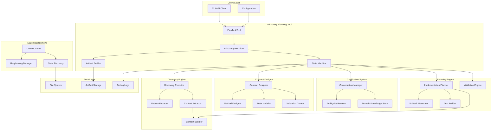
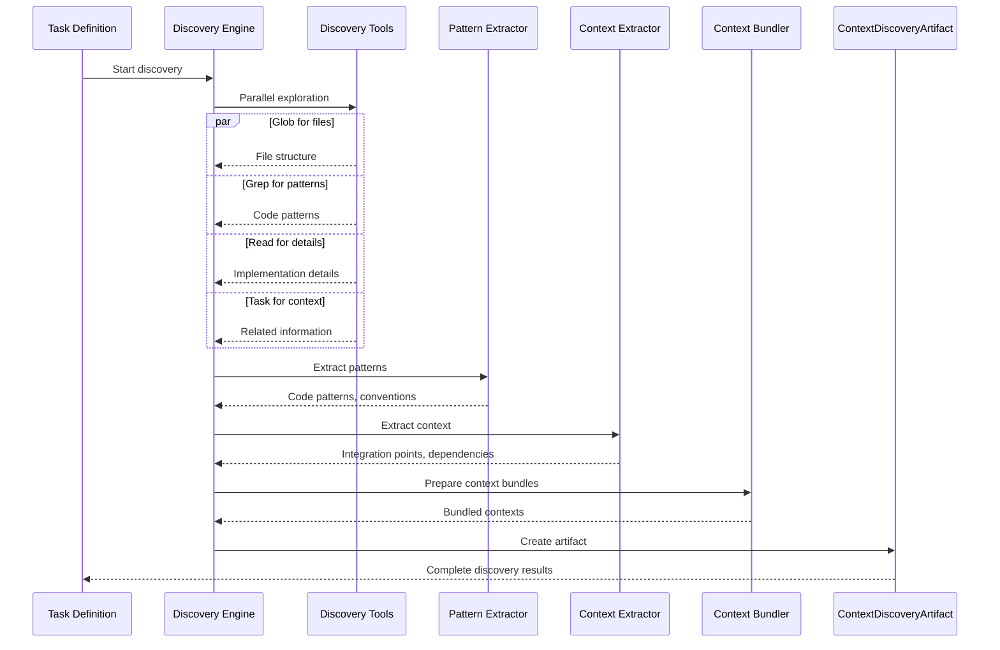
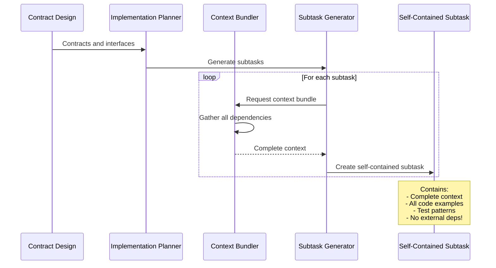

# Discovery Planning Architecture Overview

## Introduction

The Discovery Planning System represents a fundamental shift in how AI approaches complex software development tasks. Rather than following a rigid, linear planning process, it mirrors the natural problem-solving approach of expert developers: explore deeply, ask clarifying questions, design interfaces first, then create detailed implementation plans with complete context.

## Core Design Philosophy

### 1. **Context Saturation Before Planning**
The system prioritizes deep understanding over quick planning:
- **Parallel Discovery**: Uses multiple tools simultaneously (Glob, Grep, Read, Task)
- **Pattern Recognition**: Identifies existing code patterns, architectures, and conventions
- **Dependency Mapping**: Understands integration points and system boundaries
- **Ambiguity Collection**: Gathers questions during exploration, not after

### 2. **Conversational Intelligence**
Human-AI collaboration through natural dialogue:
- **Interactive Clarification**: Real conversations, not just Q&A
- **Domain Knowledge Transfer**: Captures expertise not in training data
- **Contextual Follow-ups**: Questions build on previous answers
- **Adaptive Understanding**: Refines requirements based on clarifications

### 3. **Contract-First Development**
Design decisions before implementation details:
- **Interface Specifications**: Method signatures with types and contracts
- **Data Model Definitions**: Complete schemas with validation rules
- **API Contracts**: External interfaces fully specified
- **Error Handling Patterns**: Exception types and handling strategies

### 4. **Self-Contained Work Units**
Revolutionary approach to task decomposition:
- **Complete Context Bundles**: Each subtask has ALL necessary information
- **Zero External Dependencies**: No need to look up patterns or examples
- **Parallel Executability**: Subtasks can be done in any order
- **Sub-agent Ready**: Can be assigned to specialized agents

### 5. **Dynamic Adaptation**
Workflow adjusts to task complexity:
- **Complexity Assessment**: Automatic evaluation during discovery
- **Phase Skipping**: Skip CONTRACTS for simple tasks
- **Re-planning Support**: Handle changing requirements gracefully
- **Autonomous Mode**: Optional human-free operation

## System Architecture



## Component Deep Dive

### 1. **Discovery Engine**
The heart of context gathering:

```python
class DiscoveryEngine:
    def __init__(self):
        self.pattern_extractor = PatternExtractor()
        self.context_extractor = ContextExtractor()
        self.integration_mapper = IntegrationMapper()
    
    async def discover(self, task: Task) -> ContextDiscoveryArtifact:
        # Parallel exploration
        patterns = await self.extract_patterns()
        context = await self.extract_context()
        integrations = await self.map_integrations()
        ambiguities = await self.identify_ambiguities()
        
        return ContextDiscoveryArtifact(
            codebase_understanding=deep_analysis,
            code_patterns=patterns,
            integration_points=integrations,
            ambiguities_discovered=ambiguities,
            extracted_context=context,
            complexity_assessment=self.assess_complexity()
        )
```

### 2. **Context Bundler**
Creates self-contained execution contexts:

```python
class ContextBundler:
    def bundle_for_subtask(self, subtask: Subtask, discovery: ContextDiscoveryArtifact) -> ContextBundle:
        return ContextBundle(
            existing_code=self.get_current_file_content(subtask.location),
            related_code_snippets=self.extract_relevant_examples(discovery),
            data_models=self.get_model_definitions(discovery),
            utility_functions=self.get_available_utilities(discovery),
            testing_patterns=self.extract_test_patterns(discovery),
            error_handling_patterns=self.extract_error_patterns(discovery),
            dependencies_available=self.get_import_list(discovery)
        )
```

### 3. **Conversation Manager**
Handles human-AI dialogue:

```python
class ConversationManager:
    def manage_clarification(self, ambiguities: List[AmbiguityItem]) -> ClarificationArtifact:
        conversation_log = []
        resolved_ambiguities = []
        
        for ambiguity in ambiguities:
            # Present with context
            response = self.present_ambiguity(ambiguity)
            
            # Handle follow-ups
            while needs_clarification(response):
                follow_up = self.generate_follow_up(response)
                response = self.get_human_response(follow_up)
            
            resolved_ambiguities.append(self.resolve(ambiguity, response))
            conversation_log.extend(self.format_exchange())
        
        return ClarificationArtifact(
            resolved_ambiguities=resolved_ambiguities,
            conversation_log=conversation_log,
            domain_knowledge_gained=self.extract_domain_knowledge()
        )
```

### 4. **Re-planning Manager**
Handles requirement changes:

```python
class ReplanningManager:
    def initiate_replanning(self, trigger: str, changes: str) -> RestartContext:
        return RestartContext(
            trigger=trigger,  # requirements_changed, implementation_failed
            restart_from=self.determine_restart_state(changes),
            changes=changes,
            preserve_artifacts=self.identify_reusable_artifacts(),
            invalidated_decisions=self.identify_obsolete_work()
        )
```

## Data Flow Architecture

### Discovery Phase Flow


### Self-Contained Subtask Generation


## Directory Structure

```
.alfred/
├── config.json                  # Alfred configuration
├── discovery.yml               # Discovery settings
├── tasks/                      # Task definitions
│   └── TK-01.md               # Task using new format
├── workspace/
│   └── TK-01/
│       ├── state.json          # Tool state persistence
│       ├── discovery/          # Discovery artifacts
│       │   ├── context.json    # Discovery results
│       │   ├── patterns.json   # Extracted patterns
│       │   └── ambiguities.json # Questions found
│       ├── clarification/      # Clarification artifacts
│       │   ├── conversation.log # Dialogue history
│       │   └── resolutions.json # Resolved ambiguities
│       ├── contracts/          # Contract definitions
│       │   ├── methods.json    # Method contracts
│       │   ├── models.json     # Data models
│       │   └── apis.json       # API contracts
│       ├── subtasks/           # Self-contained subtasks
│       │   ├── ST-001/         # Individual subtask
│       │   │   ├── bundle.json # Complete context
│       │   │   └── spec.json   # Implementation spec
│       │   └── ST-002/
│       └── scratchpad.md       # Human-readable progress
└── debug/
    └── TK-01/
        ├── alfred.log          # Execution logs
        └── discovery.trace     # Discovery trace
```

## Integration Architecture

### With Base Alfred System
- Extends `BaseWorkflowTool` maintaining compatibility
- Uses standard `submit_work` and `approve_review` patterns
- Integrates with orchestrator lifecycle management
- Follows all architectural principles (state machine, handler, template)

### With External Tools
- **MCP Tools**: Leverages available MCP tools for discovery
- **File System**: Direct integration for code analysis
- **Version Control**: Git-aware for change context
- **Testing Frameworks**: Understands test patterns

### With Future Tools
- **implement_task**: Consumes self-contained subtasks
- **test_task**: Uses embedded test strategies
- **deploy_task**: Leverages validation artifacts

## Performance Architecture

### Parallel Discovery
- Concurrent tool execution reduces discovery time
- Intelligent caching of discovered patterns
- Incremental discovery for re-planning

### Memory Efficiency
- Streaming large file analysis
- Context compression for storage
- Lazy loading of artifacts

### Scalability
- Handles codebases of any size
- Subtask chunking for large plans
- Distributed discovery possible

## Security Considerations

### Code Analysis
- Sandboxed discovery execution
- No code execution during planning
- Pattern matching without evaluation

### Data Protection
- Sensitive data masking in artifacts
- Secure storage of domain knowledge
- Audit trail for all decisions

## Extensibility Points

### Custom Discovery Tools
```python
class CustomDiscoveryTool:
    def discover(self, task: Task) -> DiscoveryResult:
        # Custom discovery logic
        pass
```

### Pattern Libraries
```python
class PatternLibrary:
    def register_pattern(self, pattern: CodePattern):
        # Add domain-specific patterns
        pass
```

### Contract Validators
```python
class ContractValidator:
    def validate(self, contract: MethodContract) -> ValidationResult:
        # Custom validation logic
        pass
```

## Architectural Principles

1. **Discovery Before Decision**: Never plan without context
2. **Human in the Loop**: Leverage human expertise effectively
3. **Contracts as Truth**: Interfaces define implementation
4. **Context is King**: Bundle everything needed for execution
5. **Graceful Adaptation**: Handle changes without starting over
6. **Audit Everything**: Complete trail of decisions and reasons

This architecture enables Alfred to approach complex tasks the way expert developers do - with deep understanding, clear communication, and comprehensive planning that actually works in practice.