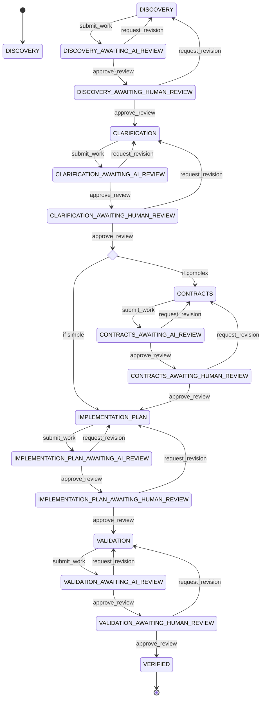
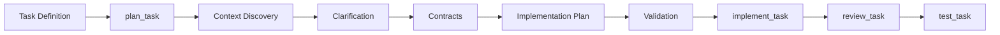

# Discovery Planning Tool Design

## Overview

The Discovery Planning Tool (`plan_task`) revolutionizes how AI approaches complex software development tasks. Instead of linear, assumption-based planning, it implements a discovery-first approach that mirrors how expert developers actually work: explore thoroughly, clarify ambiguities through conversation, design contracts before implementation, and create truly independent work units.

## Purpose and Goals

### Primary Purpose
Transform high-level task descriptions into self-contained, executable subtasks through:
1. Comprehensive context discovery using parallel exploration
2. Interactive clarification of ambiguities with domain experts
3. Contract-first interface and API design
4. Generation of completely self-contained subtasks
5. Validation of plan coherence and completeness

### Key Goals
- **Eliminate Rediscovery**: Subtasks contain ALL necessary context
- **Enable Parallelism**: Subtasks can execute in any order
- **Capture Domain Knowledge**: Learn from human expertise
- **Adapt to Complexity**: Adjust workflow based on task needs
- **Support Evolution**: Handle changing requirements gracefully

## State Machine Design



## Tool Lifecycle

### 1. **Initialization and Configuration**
```python
# Standard initialization
tool = PlanTaskTool(task_id="TK-01")

# With autonomous mode
tool = PlanTaskTool(task_id="TK-01", autonomous_mode=True)

# With re-planning context
tool = PlanTaskTool(
    task_id="TK-01", 
    restart_context={
        "trigger": "requirements_changed",
        "restart_from": "CONTRACTS",
        "changes": "Need to add SAML support",
        "preserve_artifacts": ["discovery", "clarification"]
    }
)
```

### 2. **State Persistence and Recovery**
- State saved after every transition
- Complete context preserved
- Can recover from any interruption
- Re-planning preserves completed work

### 3. **Context Management**
The context store accumulates artifacts and knowledge:
```python
context_store = {
    # After DISCOVERY
    "context_discovery_artifact": ContextDiscoveryArtifact(...),
    "discovery_notes": "Parallel exploration findings",
    
    # After CLARIFICATION  
    "clarification_artifact": ClarificationArtifact(...),
    "domain_knowledge": "Human expertise captured",
    
    # After CONTRACTS
    "contract_design_artifact": ContractDesignArtifact(...),
    "interface_decisions": "API design choices",
    
    # After IMPLEMENTATION_PLAN
    "implementation_plan_artifact": ImplementationPlanArtifact(...),
    "subtask_bundles": "Self-contained contexts",
    
    # Configuration
    "autonomous_mode": False,
    "skip_contracts": False,  # For simple tasks
    "complexity_assessment": "MEDIUM"
}
```

## Phase-by-Phase Design

### Phase 1: DISCOVERY
**Purpose**: Deep, parallel exploration of the codebase

**Process**:
1. **Parallel Tool Execution**:
   ```python
   async def discover():
       results = await asyncio.gather(
           glob_patterns(),      # Find relevant files
           grep_patterns(),      # Search for implementations
           read_key_files(),     # Examine core components
           explore_context()     # Understand system
       )
   ```

2. **Pattern Extraction**:
   - Error handling patterns
   - Testing approaches
   - Architectural patterns
   - Coding conventions

3. **Integration Mapping**:
   - API endpoints
   - Database connections
   - Service dependencies
   - File system interactions

4. **Ambiguity Collection**:
   - Technical uncertainties
   - Business logic questions
   - Architecture decisions
   - Integration choices

**Output**: `ContextDiscoveryArtifact`
```python
{
    "codebase_understanding": {
        "components": ["UserService", "AuthMiddleware"],
        "patterns": ["Repository pattern", "JWT middleware"],
        "conventions": ["ESLint config", "Test structure"]
    },
    "code_patterns": [
        {
            "pattern_type": "error_handling",
            "example_code": "try { ... } catch (e) { logger.error(e); throw new AppError(e); }",
            "usage_context": "Standard error handling approach",
            "file_locations": ["src/services/*.js"]
        }
    ],
    "integration_points": [
        {
            "component_name": "Express Router",
            "integration_type": "API_ENDPOINT",
            "interface_signature": "router.post('/auth/login', validateBody, controller)",
            "dependencies": ["express", "body-parser"],
            "examples": ["src/routes/users.js:15-20"]
        }
    ],
    "ambiguities_discovered": [
        {
            "question": "Should JWT tokens be stored in database for revocation?",
            "context": "No current token blacklist implementation found",
            "impact_if_wrong": "Security vulnerability if tokens can't be revoked",
            "discovery_source": "Analysis of current auth implementation"
        }
    ],
    "extracted_context": {
        "middleware_pattern": "module.exports = (req, res, next) => { ... }",
        "test_structure": "describe/it blocks with beforeEach setup"
    },
    "complexity_assessment": "MEDIUM"
}
```

### Phase 2: CLARIFICATION
**Purpose**: Interactive dialogue to resolve ambiguities

**Process**:
1. **Conversational Presentation**:
   - Present ambiguities with full context
   - Group related questions
   - Provide discovered examples

2. **Intelligent Follow-up**:
   - Ask clarifying questions based on responses
   - Explore edge cases mentioned
   - Capture domain-specific requirements

3. **Knowledge Extraction**:
   - Business rules not in code
   - Performance requirements
   - Security constraints
   - Future considerations

**Interaction Example**:
```
AI: "I discovered two authentication approaches in your codebase:
     1. OAuth2Service - handles external providers (Google, GitHub)
     2. LegacyAuthService - session-based for web UI
     
     For the JWT implementation, should I:
     a) Extend OAuth2Service to handle local JWT auth?
     b) Create a new dedicated JWTAuthService?
     c) Refactor LegacyAuthService to use JWT?
     
     Context: OAuth2Service is well-tested but complex. Creating new 
     service gives clean separation but more code."

Human: "Create new JWTAuthService. We're phasing out Legacy and OAuth2 
       is specifically for external providers."

AI: "Perfect! For the new JWTAuthService, I need to clarify token storage:
     1. Store refresh tokens in database for revocation?
     2. Redis for token blacklist?
     3. No storage - rely on short expiry?
     
     Also, what about rate limiting for login attempts?"

Human: "Use database for refresh tokens. No Redis yet. Add rate limiting - 
       5 attempts per 15 minutes per IP."
```

**Output**: `ClarificationArtifact`
```python
{
    "resolved_ambiguities": [
        {
            "original_question": "Which auth service to use/extend?",
            "human_response": "Create new JWTAuthService",
            "clarification": "New service for clean separation from OAuth2",
            "follow_up_questions": ["Token storage?", "Rate limiting?"],
            "final_decision": "New JWTAuthService with DB storage and rate limiting"
        }
    ],
    "updated_requirements": [
        {
            "original_requirement": "Add JWT authentication",
            "updated_requirement": "Add JWT auth with DB-stored refresh tokens and IP rate limiting",
            "reason_for_change": "Clarified storage and security requirements"
        }
    ],
    "domain_knowledge_gained": [
        "Legacy auth being phased out",
        "OAuth2Service reserved for external providers only",
        "Database preferred over Redis for now",
        "Rate limiting requirement: 5/15min/IP"
    ],
    "conversation_log": [...],
    "business_context": {
        "phase_out_timeline": "Legacy auth deprecated in 6 months",
        "security_priority": "High - financial data access"
    }
}
```

### Phase 3: CONTRACTS (Skippable for Simple Tasks)
**Purpose**: Design all interfaces before implementation

**Complexity Check**:
```python
def should_skip_contracts(discovery_artifact):
    return (
        discovery_artifact.complexity_assessment == "LOW" and
        len(discovery_artifact.relevant_files) <= 3 and
        len(discovery_artifact.integration_points) == 0 and
        len(discovery_artifact.code_patterns) > 0  # Uses existing patterns
    )
```

**Process**:
1. **Method Contract Design**:
   - Signatures with full types
   - Purpose and behavior
   - Error conditions
   - Test approach

2. **Data Model Specification**:
   - Field definitions
   - Validation rules
   - Relationships
   - Examples

3. **API Contract Definition**:
   - Endpoints and methods
   - Request/response schemas
   - Error responses
   - Authentication

**Output**: `ContractDesignArtifact`
```python
{
    "method_contracts": [
        {
            "class_name": "JWTAuthService",
            "method_name": "generateTokenPair",
            "signature": "generateTokenPair(userId: string, metadata?: object) -> TokenPair",
            "purpose": "Generate access and refresh token pair for user",
            "parameters": [
                {"name": "userId", "type": "string", "description": "User identifier"},
                {"name": "metadata", "type": "object", "description": "Optional token metadata"}
            ],
            "return_type": "TokenPair",
            "error_handling": ["InvalidUserError", "TokenGenerationError"],
            "test_approach": "Verify both tokens generated with correct claims and expiry"
        }
    ],
    "data_models": [
        {
            "name": "TokenPair",
            "description": "Access and refresh token pair",
            "fields": [
                {"name": "accessToken", "type": "string", "validation": "JWT format"},
                {"name": "refreshToken", "type": "string", "validation": "UUID v4"},
                {"name": "expiresIn", "type": "number", "validation": "positive integer"}
            ],
            "relationships": [{"to": "User", "type": "belongs_to"}]
        }
    ],
    "api_contracts": [
        {
            "endpoint": "/auth/login",
            "method": "POST",
            "description": "Authenticate user and return tokens",
            "request_schema": {
                "email": {"type": "string", "format": "email", "required": true},
                "password": {"type": "string", "minLength": 8, "required": true}
            },
            "response_schema": {
                "tokens": {"$ref": "#/definitions/TokenPair"},
                "user": {"$ref": "#/definitions/UserProfile"}
            },
            "error_responses": [
                {"code": 401, "type": "InvalidCredentials"},
                {"code": 429, "type": "RateLimitExceeded"}
            ]
        }
    ]
}
```

### Phase 4: IMPLEMENTATION_PLAN
**Purpose**: Create self-contained subtasks with complete context

**Process**:
1. **File Operation Planning**:
   - Identify exact files to create/modify
   - Specify operation types
   - Describe changes

2. **Context Bundle Creation**:
   ```python
   for subtask in subtasks:
       bundle = ContextBundle(
           existing_code=read_file(subtask.location),
           related_code_snippets=extract_patterns(discovery),
           data_models=get_model_definitions(contracts),
           utility_functions=get_available_utils(discovery),
           testing_patterns=extract_test_patterns(discovery),
           error_handling_patterns=extract_error_patterns(discovery),
           dependencies_available=get_imports(discovery)
       )
       subtask.context_bundle = bundle
   ```

3. **Test Strategy Integration**:
   - Unit test specifications
   - Integration test requirements
   - Test data needs
   - Coverage targets

**Output**: `ImplementationPlanArtifact`
```python
{
    "file_operations": [
        {
            "file_path": "src/services/JWTAuthService.js",
            "operation": "CREATE",
            "changes_description": "New service with token generation and validation",
            "affected_methods": ["generateTokenPair", "validateToken", "refreshTokens"]
        }
    ],
    "subtasks": [
        {
            "subtask_id": "ST-001",
            "title": "Create JWTAuthService with token generation",
            "location": "src/services/JWTAuthService.js",
            "operation": "CREATE",
            "context_bundle": {
                "existing_patterns": "class UserService { constructor(userRepo) {...} }",
                "jwt_examples": "jwt.sign(payload, SECRET, {expiresIn: '30m'})",
                "error_patterns": "throw new ValidationError('message')",
                "test_patterns": "describe('Service', () => { beforeEach(...) })"
            },
            "specification": {
                "steps": [
                    "Create JWTAuthService class following UserService pattern",
                    "Implement generateTokenPair method per contract",
                    "Add JWT signing with 30m access, 7d refresh",
                    "Include userId and metadata in token claims",
                    "Return TokenPair object"
                ],
                "constraints": ["Use existing jwt library", "Follow error patterns"]
            },
            "testing": {
                "unit_tests_to_create": [
                    "test_generateTokenPair_success",
                    "test_generateTokenPair_invalid_user",
                    "test_token_expiry_times"
                ],
                "test_data": [{"userId": "test-123", "metadata": {"role": "user"}}],
                "verification_steps": ["Tokens decode correctly", "Expiry times match"]
            },
            "acceptance_criteria": [
                "Method exists with correct signature",
                "Tokens generated with proper claims",
                "Error handling follows patterns"
            ],
            "dependencies": []  // Always empty - context bundle has everything!
        }
    ],
    "test_plan": {
        "unit_tests": [{"file": "JWTAuthService.test.js", "tests": 12}],
        "integration_tests": [{"file": "auth.integration.test.js", "tests": 5}],
        "coverage_requirements": {"statements": 90, "branches": 85}
    },
    "implementation_notes": [
        "Rate limiting implemented via express-rate-limit middleware",
        "Refresh tokens stored in users_tokens table",
        "Token blacklist check on each request"
    ]
}
```

### Phase 5: VALIDATION
**Purpose**: Final coherence check and quality validation

**Process**:
1. **Plan Summary Generation**:
   - File counts and complexity
   - Method and test counts
   - Effort estimation

2. **Requirement Coverage Analysis**:
   - Map each requirement to implementation
   - Assess coverage confidence
   - Identify any gaps

3. **Risk Assessment**:
   - Technical risks
   - Integration risks
   - Performance concerns
   - Security considerations

4. **Independence Verification**:
   - Validate each subtask is self-contained
   - Check context bundle completeness
   - Ensure no hidden dependencies

**Output**: `ValidationArtifact`
```python
{
    "plan_summary": {
        "files_affected": 5,
        "methods_created": 8,
        "methods_modified": 3,
        "tests_planned": 17,
        "estimated_complexity": "MEDIUM",
        "estimated_effort_hours": 16
    },
    "requirement_coverage": [
        {
            "requirement": "Users can login with email/password",
            "implementation_approach": "POST /auth/login endpoint with JWTAuthService",
            "coverage_confidence": 0.95,
            "implementation_location": "ST-001, ST-003"
        }
    ],
    "risk_assessment": [
        {
            "risk": "Token refresh race condition",
            "probability": "MEDIUM",
            "impact": "HIGH",
            "mitigation": "Implement token versioning",
            "contingency_plan": "Add distributed lock if issues arise"
        }
    ],
    "subtask_independence_check": [
        {
            "subtask_id": "ST-001",
            "is_independent": true,
            "dependencies_found": [],
            "context_completeness": 1.0
        }
    ],
    "final_approval_status": "APPROVED",
    "approval_reasoning": "All requirements covered, subtasks independent, risks identified",
    "quality_metrics": {
        "requirement_coverage": 1.0,
        "subtask_independence": 1.0,
        "context_completeness": 0.98,
        "risk_mitigation": 0.90
    }
}
```

## Key Design Patterns

### 1. **Parallel Discovery Pattern**
```python
async def discovery_phase():
    # Execute all discovery tools in parallel
    results = await asyncio.gather(
        discover_files(),
        discover_patterns(),
        discover_dependencies(),
        discover_tests(),
        return_exceptions=True  # Don't fail if one tool fails
    )
    # Merge results intelligently
    return merge_discovery_results(results)
```

### 2. **Conversational State Machine**
```python
class ConversationManager:
    def __init__(self):
        self.unanswered_questions = []
        self.conversation_history = []
        self.knowledge_base = {}
    
    def manage_dialogue(self, ambiguities):
        while self.has_unanswered_questions():
            response = self.present_next_question()
            self.process_response(response)
            self.generate_follow_ups()
        return self.build_clarification_artifact()
```

### 3. **Context Bundle Builder**
```python
class ContextBundleBuilder:
    def build_for_subtask(self, subtask, discovery, contracts):
        return ContextBundle(
            # Current state
            existing_code=self.read_current_file(subtask.location),
            
            # Patterns and examples
            related_code=self.extract_relevant_patterns(discovery),
            
            # Contracts and models
            interfaces=self.extract_relevant_contracts(contracts),
            
            # Everything else needed
            utilities=self.gather_utilities(discovery),
            test_helpers=self.gather_test_helpers(discovery)
        )
```

### 4. **Complexity Adaptation**
```python
def adapt_workflow(discovery_artifact):
    complexity = assess_complexity(discovery_artifact)
    
    if complexity == ComplexityLevel.LOW:
        return WorkflowConfig(
            skip_contracts=True,
            simplify_validation=True,
            reduce_reviews=True
        )
    elif complexity == ComplexityLevel.HIGH:
        return WorkflowConfig(
            extra_validation=True,
            require_expert_review=True,
            add_risk_analysis=True
        )
```

## Integration with Alfred Ecosystem

### Tool Dependencies
- Requires: File system access, git integration
- Provides: Self-contained subtasks for `implement_task`
- Complements: Works with all Alfred workflow tools

### Data Flow


## Extensibility Points

### Custom Discovery Tools
```python
@register_discovery_tool
class SecurityPatternDiscovery:
    def discover(self, task):
        # Find security patterns
        return SecurityPatterns(...)
```

### Domain-Specific Clarification
```python
@register_clarification_handler("finance")
class FinanceClarification:
    def generate_questions(self, ambiguities):
        # Add finance-specific questions
        pass
```

### Contract Validators
```python
@register_contract_validator
class APIContractValidator:
    def validate(self, contract):
        # Validate API contracts
        return ValidationResult(...)
```

## Future Enhancements

1. **Multi-Repository Discovery**: Explore dependencies across repositories
2. **AI Pattern Learning**: Learn from successful implementations
3. **Collaborative Planning**: Multiple humans in clarification phase
4. **Visual Planning Tools**: GUI for contract design and review
5. **Predictive Complexity**: ML-based complexity assessment

The Discovery Planning Tool transforms Alfred from a task executor to an intelligent planning partner that truly understands the codebase and collaborates effectively with developers.