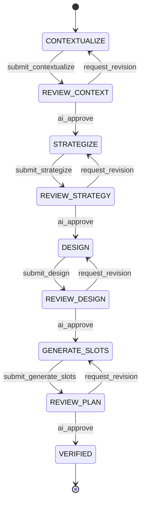

# Plan Task Tool Design

## Overview

The `plan_task` tool is the cornerstone of the Alfred workflow system. It transforms high-level task descriptions into detailed, executable work units called SLOTs (Specification, Location, Operation, Taskflow). This document details the design and implementation of this sophisticated planning system.

## Purpose

The plan_task tool serves to:
1. Analyze and understand task requirements
2. Create technical strategies aligned with business goals
3. Design file-by-file implementation plans
4. Generate atomic, executable work units (SLOTs)
5. Ensure quality through multi-stage review

## State Machine Design



## Tool Lifecycle

### 1. **Initialization**
```python
# Entry point: plan_task_impl
async def plan_task_impl(task_id: str) -> ToolResponse:
    # Check for existing tool in memory
    if task_id in orchestrator.active_tools:
        tool_instance = orchestrator.active_tools[task_id]
    else:
        # Try recovery from disk
        tool_instance = ToolRecovery.recover_tool(task_id)
        if not tool_instance:
            # Create new instance
            tool_instance = PlanTaskTool(task_id=task_id)
            orchestrator.active_tools[task_id] = tool_instance
```

### 2. **State Persistence**
- Tool state saved after every transition
- Enables recovery from crashes
- Maintains context between sessions

### 3. **Context Management**
- `context_store`: Dictionary maintaining artifacts between states
- Artifacts persist throughout tool lifecycle
- Cleared only on tool completion

## Phase-by-Phase Breakdown

### Phase 1: CONTEXTUALIZE
**Purpose**: Understand the codebase and identify ambiguities

**Process**:
1. AI analyzes existing code relevant to the task
2. Identifies affected files and systems
3. Generates questions for clarification

**Output**: `ContextAnalysisArtifact`
```python
class ContextAnalysisArtifact(BaseModel):
    context_summary: str
    affected_files: List[str]
    questions_for_developer: List[str]
```

### Phase 2: REVIEW_CONTEXT
**Purpose**: Interactive dialogue to resolve ambiguities

**Process**:
1. AI manages a "Clarification Loop"
2. Maintains checklist of unanswered questions
3. Conversationally gathers missing information
4. Only proceeds when all questions answered

**Output**: `feedback_notes` containing Q&A summary

### Phase 3: STRATEGIZE
**Purpose**: Create high-level technical approach

**Process**:
1. Incorporates developer clarifications
2. Defines overall technical strategy
3. Aligns with acceptance criteria
4. Considers system constraints

**Output**: `StrategyArtifact`
```python
class StrategyArtifact(BaseModel):
    approach: str
    key_technical_decisions: List[str]
    risk_factors: List[str]
```

### Phase 4: DESIGN
**Purpose**: Detailed file-by-file breakdown

**Process**:
1. Translates strategy to concrete changes
2. Specifies operations per file
3. Provides detailed change summaries
4. Maintains traceability to strategy

**Output**: `DesignArtifact`
```python
class FileChange(BaseModel):
    file_path: str
    operation: OperationType  # CREATE, MODIFY, DELETE, REVIEW
    summary: str

class DesignArtifact(BaseModel):
    design_overview: str
    file_breakdown: List[FileChange]
    assumptions: List[str]
```

### Phase 5: GENERATE_SLOTS
**Purpose**: Mechanical conversion to executable units

**Process**:
1. Converts each file change to SLOT(s)
2. Adds delegation for complex tasks
3. Specifies detailed taskflows
4. Ensures atomic, testable units

**Output**: `ExecutionPlanArtifact`
```python
class SLOT(BaseModel):
    slot_id: str
    title: str
    spec: str
    location: str
    operation: OperationType
    taskflow: Taskflow
    delegation: Optional[DelegationSpec]

class ExecutionPlanArtifact(BaseModel):
    slots: List[SLOT]
    estimated_complexity: str
```

## Key Design Patterns

### 1. **Artifact Validation**
Every submission validated against Pydantic models:
```python
# In submit_work_impl
artifact_model = active_tool.artifact_map.get(current_state)
if artifact_model:
    validated_artifact = artifact_model.model_validate(artifact)
```

### 2. **Context Propagation**
Artifacts flow between states via context_store:
```python
# Storing artifact
active_tool.context_store[f"{state}_artifact"] = validated_artifact

# Accessing in next state
previous_artifact = context_store.get("strategy_artifact")
```

### 3. **Dynamic Prompt Generation**
Templates access all context:
```jinja2
# In strategize.md template

Developer's clarifications:
{{ additional_context.feedback_notes }}
```

### 4. **Atomic State Transitions**
Rollback on failure prevents corruption:
```python
try:
    # Prepare everything
    next_prompt = prompter.generate_prompt(...)
    # Commit only if successful
    getattr(active_tool, trigger)()
    state_manager.save_tool_state(task_id, active_tool)
except Exception as e:
    # Rollback
    active_tool.state = original_state
    active_tool.context_store = original_context
```

## Delegation System

Complex tasks can specify delegation:
```python
class DelegationSpec(BaseModel):
    delegated_to: str  # persona name
    sub_slots: List[SLOT]
    handoff_context: str
```

This enables:
- Hierarchical task decomposition
- Specialist sub-agents for complex work
- Clear handoff protocols

## Error Handling

1. **Validation Errors**: Clear messages about structure mismatches
2. **State Errors**: Prevent invalid transitions
3. **Recovery Errors**: Graceful handling of corrupt state
4. **Prompt Errors**: Rollback prevents partial transitions

## Integration Points

### With Orchestrator:
- Registration on creation
- State persistence callbacks
- Cleanup on completion

### With Prompter:
- State-aware template selection
- Persona injection
- Context passing

### With Artifact Manager:
- Human-readable rendering
- Scratchpad maintenance
- Template-based formatting

## Future Extensibility

The design supports:
1. Additional review cycles
2. New artifact types
3. Alternative state flows
4. Plugin-based validators
5. Custom delegation strategies