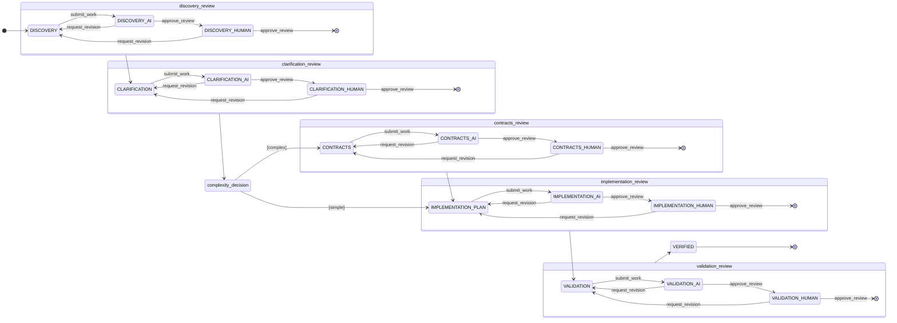

# Discovery Planning State Machine and Workflow

## Overview

The Discovery Planning system uses a sophisticated state machine built on Alfred's standard patterns while introducing dynamic adaptations for complexity handling, autonomous operation, and re-planning support. The state machine ensures predictable workflow progression while maintaining flexibility for real-world software development needs.

## State Machine Architecture

### Base Class Extension
```python
class PlanTaskTool(BaseWorkflowTool):
    def __init__(self, task_id: str, restart_context: Optional[Dict] = None, autonomous_mode: bool = False):
        super().__init__(task_id, tool_name=ToolName.PLAN_TASK)
        
        # Discovery planning specific features
        self._skip_contracts = False
        self.autonomous_mode = autonomous_mode
        self.restart_context = restart_context
        
        # Enhanced artifact mapping
        self.artifact_map = {
            PlanTaskState.DISCOVERY: ContextDiscoveryArtifact,
            PlanTaskState.CLARIFICATION: ClarificationArtifact,
            PlanTaskState.CONTRACTS: ContractDesignArtifact,
            PlanTaskState.IMPLEMENTATION_PLAN: ImplementationPlanArtifact,
            PlanTaskState.VALIDATION: ValidationArtifact,
        }
```

### State Definitions
```python
class PlanTaskState(str, Enum):
    """State enumeration for the discovery planning workflow."""
    DISCOVERY = "discovery"
    CLARIFICATION = "clarification"
    CONTRACTS = "contracts"
    IMPLEMENTATION_PLAN = "implementation_plan"
    VALIDATION = "validation"
    VERIFIED = "verified"
```

### State Machine Construction
Following Alfred's Pattern 1 (multi-step with reviews):
```python
machine_config = workflow_builder.build_workflow_with_reviews(
    work_states=[
        PlanTaskState.DISCOVERY,
        PlanTaskState.CLARIFICATION,
        PlanTaskState.CONTRACTS,
        PlanTaskState.IMPLEMENTATION_PLAN,
        PlanTaskState.VALIDATION
    ],
    terminal_state=PlanTaskState.VERIFIED,
    initial_state=initial_state,  # Can be different for re-planning
)
```

## State Transition Flow

### Standard Workflow


### Review State Pattern
Every work state follows the sacred review pattern:
```
work_state → work_state_awaiting_ai_review → work_state_awaiting_human_review → next_state
```

With revision paths:
```
work_state_awaiting_ai_review → work_state (on AI revision request)
work_state_awaiting_human_review → work_state (on human revision request)
```

## Dynamic Workflow Adaptations

### 1. Complexity-Based Phase Skipping
```python
def check_complexity_after_clarification(self) -> None:
    """Check if we should skip contracts after clarification phase."""
    discovery_artifact = self.context_store.get("context_discovery_artifact")
    
    if discovery_artifact and self.should_skip_contracts(discovery_artifact):
        self._skip_contracts = True
        self.context_store["skip_contracts"] = True
        self.context_store["complexity_note"] = "Skipping CONTRACTS phase due to LOW complexity"

def should_skip_contracts(self, discovery_artifact: ContextDiscoveryArtifact) -> bool:
    """Determine if CONTRACTS state should be skipped for simple tasks."""
    complexity_factors = {
        "is_low_complexity": discovery_artifact.complexity_assessment == 'LOW',
        "few_files": len(discovery_artifact.relevant_files) <= 3,
        "no_new_integrations": len(discovery_artifact.integration_points) == 0,
        "follows_patterns": len(discovery_artifact.code_patterns) > 0
    }
    
    return all([
        complexity_factors["is_low_complexity"],
        complexity_factors["few_files"],
        complexity_factors["no_new_integrations"]
    ])
```

### 2. Autonomous Mode
```python
def should_auto_approve(self) -> bool:
    """Check if we should automatically approve after AI review."""
    return self.autonomous_mode

def get_autonomous_config(self) -> Dict[str, Any]:
    return {
        "skip_human_reviews": self.autonomous_mode,
        "auto_approve_after_ai": self.autonomous_mode,
        "question_handling": "best_guess" if self.autonomous_mode else "interactive"
    }
```

In autonomous mode:
- AI reviews still occur (quality gate)
- Human reviews are auto-approved
- Ambiguities resolved with best guess
- Suitable for well-defined tasks

### 3. Re-planning Support
```python
def initiate_replanning(self, trigger: str, restart_from: str, changes: str, 
                       preserve_artifacts: Optional[List[str]] = None) -> Dict[str, Any]:
    """Initiate re-planning with preserved context."""
    restart_context = {
        "trigger": trigger,  # "requirements_changed", "implementation_failed", "review_failed"
        "restart_from": restart_from,  # State to restart from
        "changes": changes,  # What changed
        "preserve_artifacts": preserve_artifacts or [],
        "timestamp": datetime.now().isoformat(),
        "previous_state": self.state
    }
    
    # Store for next planning session
    self.context_store["restart_context"] = restart_context
    return restart_context

def _determine_restart_state(self, restart_context: Dict) -> PlanTaskState:
    """Determine initial state for re-planning."""
    restart_from = restart_context.get("restart_from", "DISCOVERY")
    return PlanTaskState(restart_from.lower())

def _load_preserved_artifacts(self, restart_context: Dict) -> None:
    """Load preserved artifacts from previous planning attempt."""
    preserved = restart_context.get("preserve_artifacts", [])
    for artifact_name in preserved:
        self.context_store[f"preserved_{artifact_name}"] = restart_context.get(artifact_name)
```

## State Transition Mechanics

### Submit Work Flow
```python
async def submit_work_handler(task_id: str, artifact: dict) -> ToolResponse:
    # Get active tool
    tool = orchestrator.active_tools[task_id]
    
    # Validate artifact against current state
    artifact_model = tool.artifact_map.get(tool.state)
    validated_artifact = artifact_model.model_validate(artifact)
    
    # Store in context
    artifact_key = f"{tool.state}_artifact"
    tool.context_store[artifact_key] = validated_artifact
    
    # Special handling for discovery phase
    if tool.state == PlanTaskState.DISCOVERY:
        # Check complexity for later phase skipping
        tool.context_store["complexity_assessment"] = validated_artifact.complexity_assessment
    
    # Trigger state transition
    trigger = f"submit_{tool.state}"
    getattr(tool, trigger)()
    
    # Persist state
    state_manager.save_tool_state(task_id, tool)
    
    # Generate next prompt
    return generate_next_prompt(tool)
```

### Review Approval Flow
```python
async def approve_review_handler(task_id: str) -> ToolResponse:
    tool = orchestrator.active_tools[task_id]
    
    # Check for autonomous mode
    if tool.autonomous_mode and "_awaiting_ai_review" in tool.state:
        # Auto-advance to human review
        tool.ai_approve()
        state_manager.save_tool_state(task_id, tool)
        
        # Then auto-approve human review
        if "_awaiting_human_review" in tool.state:
            return await approve_review_handler(task_id)
    
    # Standard approval
    tool.ai_approve()
    
    # Check for complexity-based skipping
    if tool.state == "clarification_awaiting_human_review":
        tool.check_complexity_after_clarification()
        next_state = tool.get_next_state_after_clarification()
        # Transition to appropriate state
    
    # Check if entering terminal state
    if tool.is_terminal:
        complete_workflow(task_id)
    
    return generate_next_prompt(tool)
```

## Context Store Evolution

The context store accumulates knowledge through the workflow:

### After DISCOVERY
```python
{
    "context_discovery_artifact": ContextDiscoveryArtifact(...),
    "complexity_assessment": "MEDIUM",
    "discovery_start_time": "2024-01-01T10:00:00",
    "tools_used": ["glob", "grep", "read", "task"],
    "tool_failures": []  # Track any discovery tool failures
}
```

### After CLARIFICATION
```python
{
    ...previous context...,
    "clarification_artifact": ClarificationArtifact(...),
    "domain_knowledge": {...},
    "conversation_duration": 300,  # seconds
    "questions_asked": 5,
    "skip_contracts": False  # Complexity decision
}
```

### After CONTRACTS
```python
{
    ...previous context...,
    "contract_design_artifact": ContractDesignArtifact(...),
    "interface_count": 8,
    "model_count": 3,
    "api_endpoint_count": 4
}
```

### After IMPLEMENTATION_PLAN
```python
{
    ...previous context...,
    "implementation_plan_artifact": ImplementationPlanArtifact(...),
    "subtask_count": 12,
    "total_context_size": 524288,  # bytes
    "independence_score": 0.98
}
```

### After VALIDATION
```python
{
    ...previous context...,
    "validation_artifact": ValidationArtifact(...),
    "final_metrics": {...},
    "approved_by": "human",
    "completion_time": "2024-01-01T11:30:00"
}
```

## Recovery and Persistence

### State Persistence Strategy
```python
def save_tool_state(self, task_id: str, tool: PlanTaskTool):
    state_data = {
        "tool_class": "PlanTaskTool",
        "state": tool.state,
        "context_store": self._serialize_context(tool.context_store),
        "autonomous_mode": tool.autonomous_mode,
        "skip_contracts": tool._skip_contracts,
        "restart_context": tool.restart_context,
        "timestamp": datetime.now().isoformat()
    }
    
    # Save to disk
    state_file = self.get_state_file(task_id)
    state_file.write_text(json.dumps(state_data, indent=2))
    
    # Backup critical artifacts
    self._backup_artifacts(task_id, tool.context_store)
```

### Recovery Process
```python
def recover_tool(task_id: str) -> Optional[PlanTaskTool]:
    state_data = load_state_from_disk(task_id)
    if not state_data:
        return None
    
    # Reconstruct tool with saved configuration
    tool = PlanTaskTool(
        task_id=task_id,
        restart_context=state_data.get("restart_context"),
        autonomous_mode=state_data.get("autonomous_mode", False)
    )
    
    # Restore state
    tool.state = state_data["state"]
    tool.context_store = state_data["context_store"]
    tool._skip_contracts = state_data.get("skip_contracts", False)
    
    # Reconstruct state machine at correct position
    tool.machine.set_state(tool.state)
    
    return tool
```

## Advanced State Machine Features

### 1. State Transition Hooks
```python
# Before transition
@before_transition(source="discovery", dest="discovery_awaiting_ai_review")
def validate_discovery_completeness(self):
    artifact = self.context_store.get("context_discovery_artifact")
    if not artifact or not artifact.codebase_understanding:
        raise IncompleteDiscoveryError("Discovery incomplete")

# After transition
@after_transition(source="*", dest="verified")
def cleanup_resources(self):
    # Archive artifacts
    archive_tool_artifacts(self.task_id, self.context_store)
    # Clear memory
    self.context_store.clear()
```

### 2. Conditional Transitions
```python
def get_next_state_after_clarification(self) -> str:
    """Determine next state based on complexity assessment."""
    if self._skip_contracts:
        return PlanTaskState.IMPLEMENTATION_PLAN.value
    return PlanTaskState.CONTRACTS.value
```

### 3. State Timeout Handling
```python
STATE_TIMEOUTS = {
    "discovery": timedelta(minutes=10),
    "clarification": timedelta(minutes=30),  # Human interaction
    "contracts": timedelta(minutes=15),
    "implementation_plan": timedelta(minutes=20),
    "validation": timedelta(minutes=10)
}

def check_state_timeout(self):
    if self.state in STATE_TIMEOUTS:
        elapsed = datetime.now() - self.state_entered_time
        if elapsed > STATE_TIMEOUTS[self.state]:
            self.handle_timeout()
```

## Error Handling in State Machine

### 1. Discovery Tool Failures
```python
async def handle_discovery_with_failures(self):
    try:
        results = await parallel_discovery()
    except PartialDiscoveryFailure as e:
        # Some tools failed but we have enough data
        self.context_store["tool_failures"] = e.failed_tools
        self.context_store["discovery_partial"] = True
        # Continue with available data
    except CriticalDiscoveryFailure:
        # Cannot proceed without this data
        return ToolResponse(
            status="error",
            message="Critical discovery tools unavailable",
            suggestions=["Check file permissions", "Verify tool availability"]
        )
```

### 2. Artifact Validation Failures
```python
def validate_artifact_transition(self, artifact: dict) -> bool:
    """Validate artifact is sufficient for state transition."""
    validators = {
        "discovery": self.validate_discovery_artifact,
        "clarification": self.validate_clarification_artifact,
        "contracts": self.validate_contracts_artifact,
        "implementation_plan": self.validate_implementation_artifact,
        "validation": self.validate_validation_artifact
    }
    
    validator = validators.get(self.state)
    if validator:
        return validator(artifact)
    return True
```

### 3. State Corruption Recovery
```python
def recover_from_corruption(self, task_id: str):
    """Attempt to recover from corrupted state."""
    # Try to load last known good state
    for backup in self.get_state_backups(task_id):
        try:
            tool = self.load_from_backup(backup)
            if self.validate_tool_state(tool):
                return tool
        except:
            continue
    
    # Fall back to restart from last completed phase
    return self.create_from_artifacts(task_id)
```

## Best Practices

### 1. State Transition Guidelines
- Always validate artifacts before transition
- Persist state immediately after successful transition
- Handle partial failures gracefully
- Maintain audit trail of all transitions

### 2. Context Store Management
- Use namespaced keys for clarity
- Serialize complex objects properly
- Clear sensitive data after use
- Backup critical artifacts separately

### 3. Error Recovery Strategies
- Implement graceful degradation
- Provide clear error messages
- Suggest corrective actions
- Enable re-planning when appropriate

### 4. Performance Optimization
- Lazy load large artifacts
- Stream file content when possible
- Compress stored context
- Clean up completed workflows

## Future Enhancements

### 1. Parallel State Execution
Support for parallel discovery streams:
```python
parallel_states = {
    "discovery_code": DiscoverCode,
    "discovery_tests": DiscoverTests,
    "discovery_docs": DiscoverDocs
}
```

### 2. Dynamic State Injection
Add states based on discovery:
```python
if discovery_artifact.requires_security_review:
    inject_state("security_review", after="contracts")
```

### 3. Machine Learning Integration
- Predict optimal state paths
- Suggest phase skipping
- Estimate completion times
- Identify risk patterns

### 4. Distributed State Machines
- Multi-agent collaboration
- Cross-repository planning
- Team synchronization
- Conflict resolution

The Discovery Planning state machine provides a robust, flexible foundation for intelligent task planning while maintaining Alfred's architectural principles and quality guarantees.