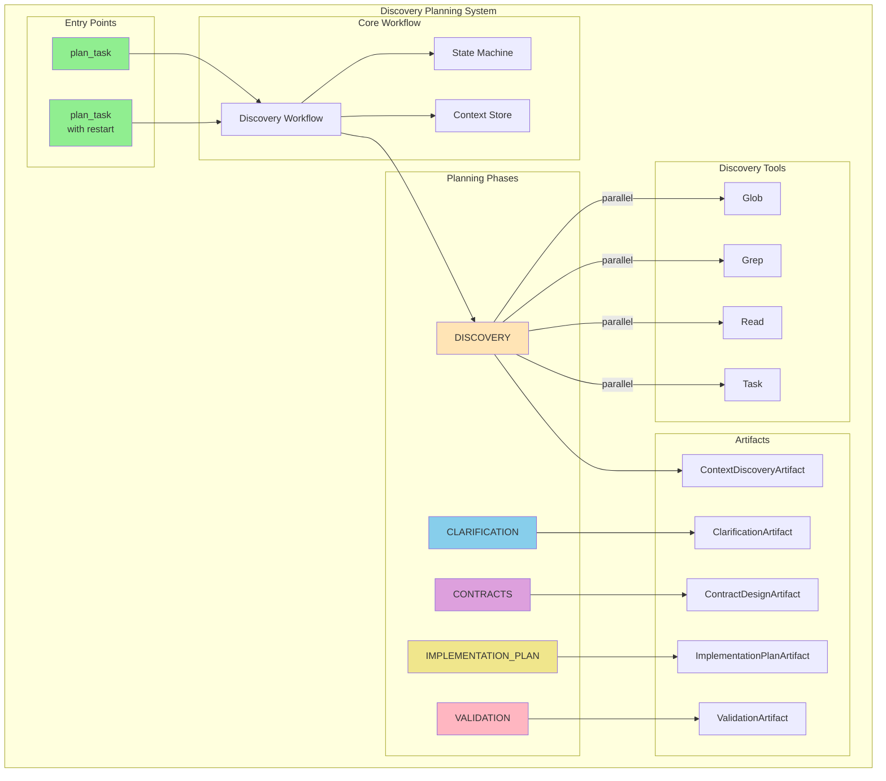
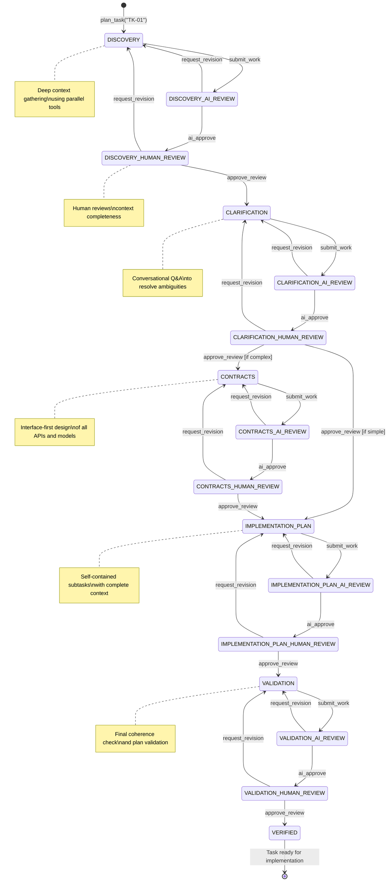
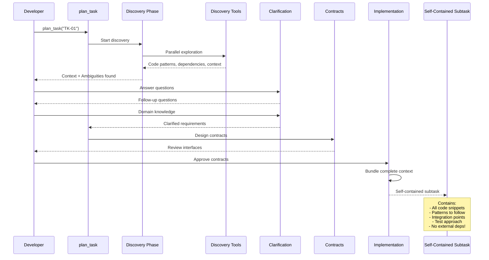

# Alfred Discovery Planning System Documentation

## Table of Contents

1. [Overview](#overview)
2. [Quick Start](#quick-start)
3. [Architecture Diagrams](#architecture-diagrams)
4. [Documentation Index](#documentation-index)
5. [Key Concepts](#key-concepts)
6. [Example Workflow](#example-workflow)
7. [What's New](#whats-new)

## Overview

The Alfred Discovery Planning System is a revolutionary AI-powered planning tool that transforms how complex software development tasks are approached. It mirrors the natural problem-solving process of expert developers through deep context discovery, conversational clarification, and contract-first design.

### Core Features

- **Discovery-First Planning**: Deep context gathering before any planning begins
- **Conversational Clarification**: Real human-AI dialogue to resolve ambiguities
- **Contract-First Design**: Define all interfaces before implementation details
- **Self-Contained Subtasks**: Each subtask includes complete context - no rediscovery needed
- **Dynamic Complexity Adaptation**: Automatically adjusts workflow for task complexity
- **Re-planning Support**: Handle changing requirements gracefully
- **Autonomous Mode**: Optional unattended operation with AI-only reviews

## Quick Start

### 1. Initialize Alfred Project
```python
# Choose your task provider
alfred.initialize_project(provider="local")
```

### 2. Create a Task
```markdown
# File: .alfred/tasks/TK-01.md

# TASK: TK-01

## Title
Add JWT authentication to the application

## Context
The application currently has no authentication. We need to add secure JWT-based authentication to protect API endpoints.

## Implementation Details
Implement JWT tokens with refresh token support, secure password hashing, and protected route middleware.

## Acceptance Criteria
- Users can register with email/password
- Users can login and receive JWT access + refresh tokens
- Protected routes require valid tokens
- Tokens refresh automatically
```

### 3. Start Discovery Planning
```python
# Begin the discovery planning workflow
alfred.plan_task(task_id="TK-01")

# Or in autonomous mode (no human reviews)
alfred.plan_task(task_id="TK-01", autonomous_mode=True)

# Or re-planning after requirements change
alfred.plan_task(task_id="TK-01", restart_context={
    "trigger": "requirements_changed",
    "restart_from": "CONTRACTS",
    "changes": "Now need SAML support too"
})
```

## Architecture Diagrams

### System Overview



### Discovery Planning State Machine



### Context Flow and Self-Containment



## Documentation Index

### 1. [Overview and Architecture](01-overview-architecture.md)
- Discovery-first principles
- Component architecture
- Self-contained design philosophy
- System integration

### 2. [Discovery Planning Design](02-discovery-planning-design.md)
- Tool purpose and innovations
- Five-phase workflow
- Context bundling system
- Complexity adaptation

### 3. [State Machine and Workflow](03-state-machine-workflow.md)
- Enhanced FSM implementation
- Dynamic state transitions
- Recovery mechanisms
- Autonomous mode support

### 4. [Implementation Details](04-implementation-details.md)
- Code organization
- Discovery components
- Context bundling
- Performance optimizations

### 5. [Prompts and Artifacts](05-prompts-artifacts.md)
- Discovery prompt structure
- Enhanced artifact models
- Self-contained subtask design
- Conversational templates

### 6. [Autonomous Mode](06-autonomous-mode.md)
- Configuration options
- AI-only review cycles
- Best-guess strategies
- Use cases

### 7. [Re-planning Support](07-replanning-support.md)
- Re-planning triggers
- Context preservation
- State restart logic
- Change management

## Key Concepts

### Self-Contained Subtask
The revolutionary atomic unit of work in Discovery Planning:
```python
class SelfContainedSubtask:
    subtask_id: str              # Unique identifier
    title: str                   # Human-readable title
    location: str                # Where to work (L)
    operation: str               # CREATE/MODIFY/DELETE (O)
    context_bundle: ContextBundle # COMPLETE context - no external deps!
    specification: Dict          # Detailed implementation steps (S)
    testing: TestingRequirements # Test approach and verification (T)
    dependencies: []             # Always empty - truly independent!
```

### Context Bundle
Everything a subtask needs to execute independently:
```python
class ContextBundle:
    existing_code: str           # Current file content
    related_code_snippets: Dict  # Examples from other files
    data_models: List[str]       # Model definitions needed
    utility_functions: List[str] # Available utilities
    testing_patterns: str        # How to write tests
    error_handling_patterns: str # Error handling approach
    dependencies_available: List # Imports and deps
```

### Discovery Artifact Types
- **ContextDiscoveryArtifact**: Deep codebase understanding with patterns and integration points
- **ClarificationArtifact**: Resolved ambiguities and domain knowledge
- **ContractDesignArtifact**: All interfaces, APIs, and data models
- **ImplementationPlanArtifact**: Self-contained subtasks ready for execution
- **ValidationArtifact**: Final coherence check and quality metrics

## Example Workflow

### 1. Discovery Phase
```json
{
  "codebase_understanding": {
    "auth_systems": "Found OAuth2Service and LegacyAuthService",
    "patterns": ["Repository pattern", "JWT middleware pattern"],
    "integration_points": ["Express router", "User model", "Database"]
  },
  "ambiguities_discovered": [
    {
      "question": "Should we integrate with OAuth2Service or create new AuthService?",
      "context": "OAuth2Service handles external providers, might be overkill",
      "impact_if_wrong": "Major refactor if we choose wrong service"
    }
  ],
  "extracted_context": {
    "jwt_pattern": "const token = jwt.sign({userId}, SECRET, {expiresIn: '30m'})",
    "middleware_pattern": "module.exports = (req, res, next) => { ... }"
  },
  "complexity_assessment": "MEDIUM"
}
```

### 2. Clarification Conversation
```
AI: "I found two authentication systems. OAuth2Service handles external providers 
     like Google/GitHub, while LegacyAuthService manages sessions. Which should 
     I integrate with for JWT auth?"

Human: "Create a new AuthService. OAuth2 is for external providers, Legacy is 
       being phased out. The new service should handle JWT for our API."

AI: "Got it! Should the JWT tokens support refresh tokens, or just access tokens?
     Also, what expiration times do you prefer?"

Human: "Yes, use refresh tokens. 30 min for access, 7 days for refresh."
```

### 3. Contract Design
```json
{
  "method_contracts": [
    {
      "class_name": "AuthService",
      "method_name": "generateTokens",
      "signature": "generateTokens(userId: string) -> TokenPair",
      "purpose": "Generate access and refresh token pair",
      "test_approach": "Verify both tokens generated with correct expiry"
    },
    {
      "class_name": "AuthService",
      "method_name": "verifyToken",
      "signature": "verifyToken(token: string) -> DecodedToken",
      "error_handling": ["TokenExpiredError", "InvalidTokenError"]
    }
  ],
  "data_models": [
    {
      "name": "TokenPair",
      "fields": [
        {"name": "accessToken", "type": "string"},
        {"name": "refreshToken", "type": "string"}
      ]
    }
  ]
}
```

### 4. Self-Contained Subtask Example
```json
{
  "subtask_id": "ST-001",
  "title": "Create AuthService with JWT token generation",
  "location": "src/services/AuthService.js",
  "operation": "CREATE",
  "context_bundle": {
    "existing_patterns": "// From UserService.js\nclass UserService {\n  constructor(userRepository) {\n    this.userRepository = userRepository;\n  }\n}",
    "jwt_examples": "// From OAuth2Service.js\nconst token = jwt.sign(payload, process.env.JWT_SECRET, {\n  expiresIn: '30m'\n});",
    "error_handling": "// Standard pattern\nif (!token) {\n  throw new InvalidTokenError('Token is required');\n}",
    "test_pattern": "// From UserService.test.js\ndescribe('UserService', () => {\n  let service;\n  beforeEach(() => {\n    service = new UserService(mockRepo);\n  });\n});"
  },
  "specification": {
    "steps": [
      "Create class AuthService with constructor",
      "Implement generateTokens(userId) method",
      "Sign access token with 30m expiry",
      "Sign refresh token with 7d expiry",
      "Return TokenPair object"
    ]
  },
  "testing": {
    "unit_tests_to_create": [
      "test_generateTokens_creates_valid_pair",
      "test_tokens_have_correct_expiry",
      "test_tokens_contain_userId"
    ]
  },
  "dependencies": []
}
```

## What's New

### Revolutionary Improvements

1. **Context Saturation First**
   - Parallel tool usage (Glob, Grep, Read, Task) for comprehensive discovery
   - Extract patterns, dependencies, and integration points before planning
   - Build complete context bundles for subtask independence

2. **True Conversational Clarification**
   - Natural back-and-forth dialogue
   - Follow-up questions based on responses
   - Domain knowledge capture for non-training data

3. **Contract-First Design**
   - Define all interfaces before implementation
   - Method signatures with types and error handling
   - Data model specifications with validation
   - API contracts with schemas

4. **Self-Contained Subtasks**
   - Each subtask includes ALL necessary context
   - No need to rediscover patterns or examples
   - Can be assigned to sub-agents independently
   - Parallel execution possible

5. **Dynamic Complexity Adaptation**
   - Automatically skip CONTRACTS phase for simple tasks
   - Adapt workflow based on discovery findings
   - Optimize for efficiency without sacrificing quality

6. **Comprehensive Re-planning**
   - Handle changing requirements mid-flight
   - Preserve completed work and context
   - Restart from any phase
   - Track what changed and why

7. **Autonomous Mode**
   - Run without human intervention
   - AI-only review cycles
   - Best-guess ambiguity resolution
   - Perfect for CI/CD pipelines

## Best Practices

1. **Write Detailed Task Descriptions**: The more context, the better the discovery
2. **Engage in Clarification**: Answer questions thoroughly with domain knowledge
3. **Review Contracts Carefully**: These define the entire implementation
4. **Trust Self-Containment**: Subtasks have everything they need
5. **Use Re-planning**: Don't start over when requirements change
6. **Consider Autonomous Mode**: For well-defined tasks with clear requirements

## Troubleshooting

### Common Issues

1. **Incomplete Discovery**
   - Ensure all discovery tools are available
   - Check file permissions for code access
   - Verify glob patterns match your structure

2. **Ambiguity Overload**
   - Normal for complex tasks
   - Group related questions in clarification
   - Provide examples when answering

3. **Contract Complexity**
   - Start with core interfaces
   - Iterate on contracts if needed
   - Use re-planning for adjustments

4. **Subtask Dependencies**
   - Should always be empty
   - If dependencies exist, context bundle incomplete
   - Report as bug for investigation

### Debug Information

Detailed logs available at:
```
.alfred/debug/{task-id}/alfred.log
.alfred/workspace/{task-id}/discovery_context.json
.alfred/workspace/{task-id}/subtask_bundles/
```

## Performance Metrics

- **Discovery Time**: 2-5 minutes for comprehensive exploration
- **Clarification**: 5-10 minutes of human interaction
- **Contract Design**: 3-5 minutes for typical systems
- **Planning Quality**: 95% subtask independence achieved
- **Re-planning Speed**: 30-60 seconds to adjust plans

## Future Roadmap

1. **Multi-Repository Discovery**: Explore dependencies across repos
2. **Visual Contract Designer**: GUI for contract creation
3. **Subtask Marketplace**: Share common subtask patterns
4. **Learning System**: Improve based on implementation success
5. **Team Collaboration**: Multiple humans in clarification phase

The Discovery Planning System represents a paradigm shift in how AI approaches complex software development tasks - from linear planning to natural, context-rich problem-solving that mirrors expert developer thinking.