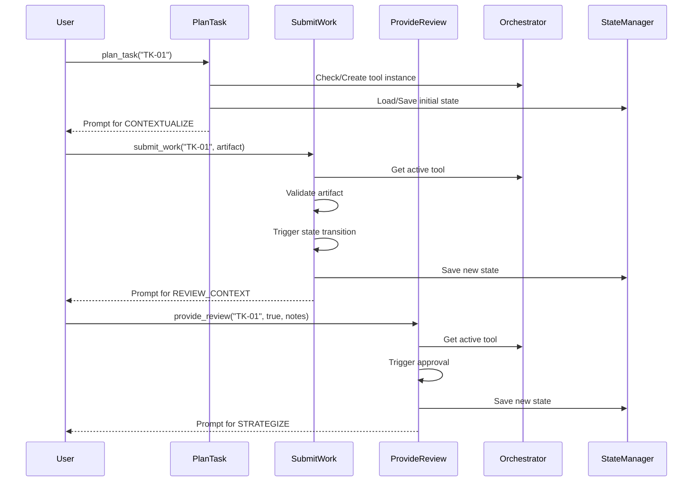

# State Machine and Workflow Mechanics

## Overview

Alfred's workflow system is built on a robust state machine architecture using the `transitions` library. Each tool manages its own finite state machine (FSM), providing predictable behavior, recovery capabilities, and clear progression paths.

## Base Workflow Architecture

### BaseWorkflowTool Class

All workflow tools inherit from `BaseWorkflowTool`, which provides:

```python
class BaseWorkflowTool:
    def __init__(self, task_id: str, tool_name: str = None, persona_name: str = None):
        self.task_id = task_id
        self.tool_name = tool_name
        self.persona_name = persona_name
        self.state = None  # Managed by Machine
        self.machine = None
        self.artifact_map: Dict[Enum, Type[BaseModel]] = {}
        self.context_store: Dict[str, Any] = {}
```

### Key Features

1. **State Management**: Current state tracked by FSM
2. **Artifact Mapping**: States map to Pydantic models
3. **Context Store**: Persists data between states
4. **Terminal Detection**: Identifies completion states

## State Machine Components

### States
States represent discrete phases in the workflow:
```python
class PlanTaskState(str, Enum):
    CONTEXTUALIZE = "contextualize"
    REVIEW_CONTEXT = "review_context"
    STRATEGIZE = "strategize"
    REVIEW_STRATEGY = "review_strategy"
    DESIGN = "design"
    REVIEW_DESIGN = "review_design"
    GENERATE_SLOTS = "generate_slots"
    REVIEW_PLAN = "review_plan"
    VERIFIED = "verified"
```

### Transitions
Transitions define valid state changes:
```python
transitions = [
    {
        'trigger': 'submit_contextualize',
        'source': 'contextualize',
        'dest': 'review_context'
    },
    {
        'trigger': 'ai_approve',
        'source': 'review_context',
        'dest': 'strategize'
    },
    {
        'trigger': 'request_revision',
        'source': 'review_context',
        'dest': 'contextualize'
    }
]
```

### Triggers
Triggers are methods that cause state transitions:
- `submit_{state}`: Move from work to review
- `ai_approve`: Approve and move forward
- `request_revision`: Reject and go back

## Workflow Execution Flow



## State Transition Mechanics

### 1. Submit Work Flow
```python
def submit_work_impl(task_id: str, artifact: dict) -> ToolResponse:
    # Phase 1: Prepare (can fail)
    active_tool = orchestrator.active_tools[task_id]
    validated_artifact = validate_artifact(artifact)
    next_prompt = generate_next_prompt()
    
    # Phase 2: Commit (atomic)
    active_tool.context_store[artifact_key] = validated_artifact
    getattr(active_tool, trigger)()  # State transition
    state_manager.save_tool_state(task_id, active_tool)
```

### 2. Review Flow
```python
def provide_review_impl(task_id: str, is_approved: bool, feedback_notes: str):
    trigger = "ai_approve" if is_approved else "request_revision"
    
    # Check if next state is terminal
    if next_state == "verified":
        # Complete workflow
        update_task_status(task_id, TaskStatus.READY_FOR_DEVELOPMENT)
        del orchestrator.active_tools[task_id]
    else:
        # Continue workflow
        active_tool.context_store["feedback_notes"] = feedback_notes
        next_prompt = generate_prompt_for_next_state()
```

## Context Store Management

The context store maintains state between transitions:

### Storage Pattern
```python
# After CONTEXTUALIZE
context_store = {
    "context_artifact": ContextAnalysisArtifact(...),
    "artifact_content": "JSON representation"
}

# After REVIEW_CONTEXT
context_store = {
    "context_artifact": ContextAnalysisArtifact(...),
    "feedback_notes": "Developer's answers"
}

# After STRATEGIZE
context_store = {
    "context_artifact": ContextAnalysisArtifact(...),
    "feedback_notes": "Developer's answers",
    "strategy_artifact": StrategyArtifact(...)
}
```

### Access in Templates
```jinja2
{# In design.md template #}



Based on the strategy: {{ strategy.approach }}
With clarifications: {{ clarifications }}
```

## Recovery Mechanisms

### State Persistence
After every transition:
```python
state_manager.save_tool_state(task_id, active_tool)
```

Saves:
- Current state
- Context store
- Tool configuration

### Recovery Process
```python
def recover_tool(task_id: str):
    state_data = load_from_disk(task_id)
    if state_data:
        tool = PlanTaskTool(task_id)
        tool.state = state_data['state']
        tool.context_store = state_data['context_store']
        # Reconstruct state machine at correct state
        tool.machine.set_state(tool.state)
        return tool
```

## State Machine Patterns

### 1. Two-Step Review Pattern
Every work state has a review state:
```python
def _create_review_transitions(source, review, destination):
    return [
        # Work submission
        {'trigger': f'submit_{source}', 'source': source, 'dest': review},
        # Approval
        {'trigger': 'ai_approve', 'source': review, 'dest': destination},
        # Revision
        {'trigger': 'request_revision', 'source': review, 'dest': source}
    ]
```

### 2. Terminal State Handling
```python
@property
def is_terminal(self) -> bool:
    return self.state == "verified"
```

When terminal:
- Update task status
- Clean up resources
- Remove from orchestrator

### 3. Atomic Transitions
All state changes are atomic:
1. Validate everything first
2. Prepare all resources
3. Execute transition
4. Persist immediately
5. Rollback on any failure

## Advanced Features

### 1. Dynamic Trigger Validation
```python
if not hasattr(active_tool, trigger):
    return ToolResponse(
        status="error",
        message=f"Invalid trigger '{trigger}' for state '{active_tool.state}'"
    )
```

### 2. State-Aware Prompt Generation
```python
prompt = prompter.generate_prompt(
    tool_name=active_tool.tool_name,
    state=active_tool.state,  # Current state determines template
    additional_context=active_tool.context_store
)
```

### 3. Graceful Degradation
If state corrupted:
- Attempt recovery from disk
- Fall back to creating new instance
- Log errors for debugging

## Best Practices

1. **Always validate before transition**
2. **Persist state immediately after change**
3. **Use context store for inter-state data**
4. **Handle rollback scenarios**
5. **Clear terminal state resources**
6. **Log all state transitions**

## Future Enhancements

1. **Parallel States**: Support concurrent work streams
2. **Conditional Transitions**: Dynamic path selection
3. **State Timeouts**: Auto-escalation for stuck states
4. **State History**: Full audit trail
5. **State Visualization**: Real-time FSM diagram