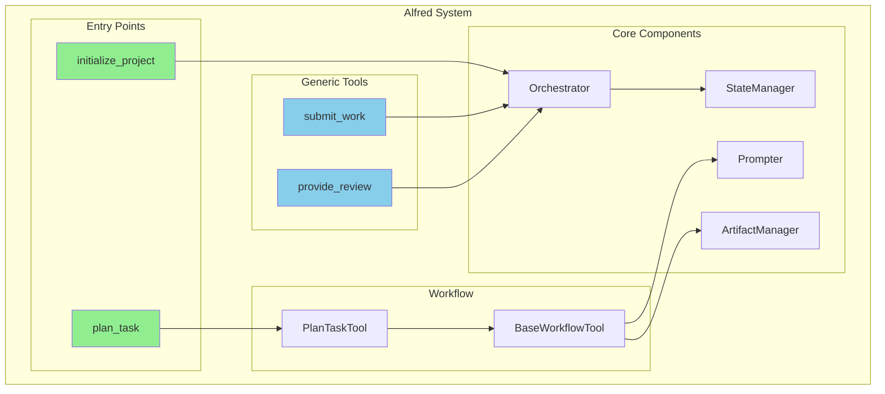
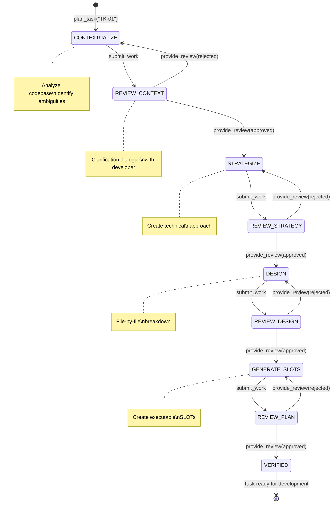
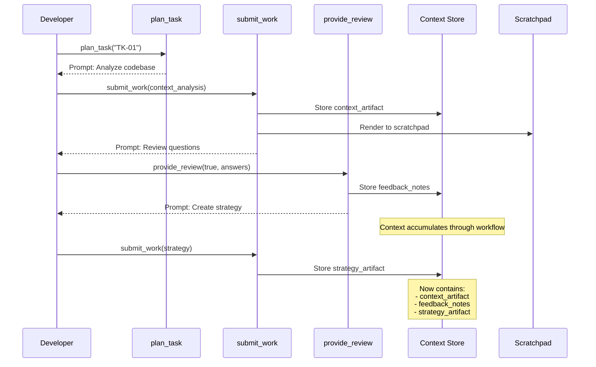
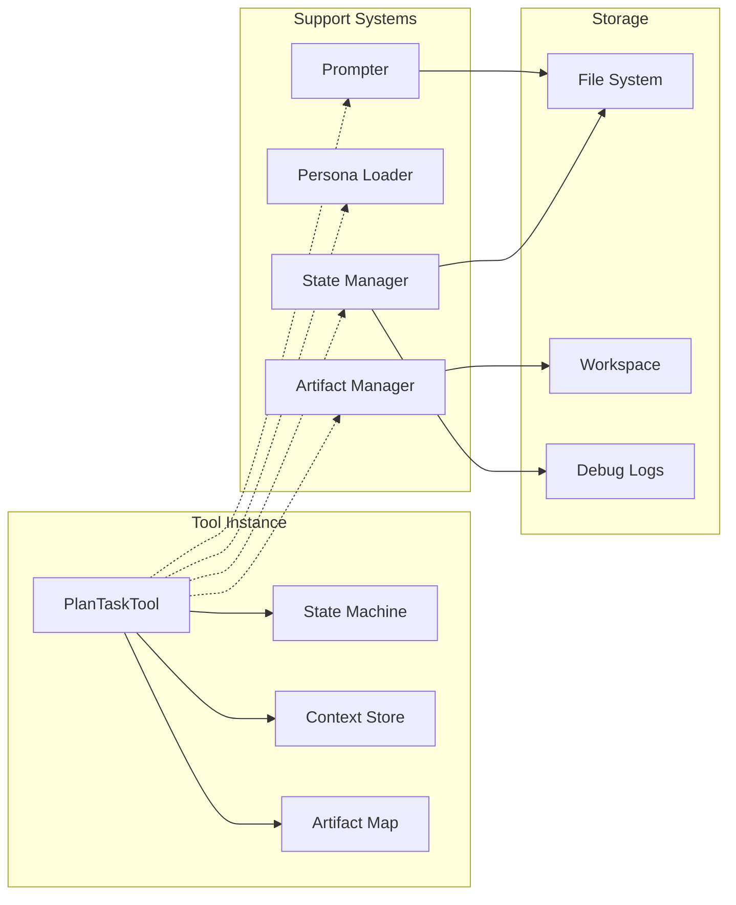

# Alfred Plan Task Tool Documentation

## Table of Contents

1. [Overview](#overview)
2. [Quick Start](#quick-start)
3. [Architecture Diagrams](#architecture-diagrams)
4. [Documentation Index](#documentation-index)
5. [Key Concepts](#key-concepts)
6. [Example Workflow](#example-workflow)

## Overview

The Alfred Plan Task Tool is a sophisticated AI-powered planning system that transforms high-level task descriptions into detailed, executable work units. Built with a state machine architecture, it ensures quality through multi-stage reviews and enables seamless human-AI collaboration.

### Core Features

- **State Machine Driven**: Predictable workflow with recovery capabilities
- **Multi-Phase Planning**: Context → Strategy → Design → Execution Plan
- **Two-Step Review**: AI self-review followed by human approval
- **Strongly Typed**: Pydantic models ensure data integrity
- **Persona System**: Specialized AI agents with unique communication styles
- **Recovery Capable**: Resume from any state after interruption

## Quick Start

### 1. Initialize Alfred Project
```python
# Choose your task provider
alfred.initialize_project(provider="local")
```

### 2. Create a Task
```markdown
# File: .alfred/tasks/TK-01.md

# TK-01

## Summary
Add user authentication to the application

## Description
Implement JWT-based authentication with login/logout endpoints

## Acceptance Criteria
- [ ] Users can register with email/password
- [ ] Users can login and receive JWT token
- [ ] Protected routes require valid token
```

### 3. Start Planning
```python
# Begin the planning workflow
alfred.plan_task(task_id="TK-01")
```

## Architecture Diagrams

### System Overview



### Plan Task State Machine



### Data Flow



### Component Architecture



## Documentation Index

### 1. [Overview and Architecture](01-overview-architecture.md)
- System design principles
- Component overview
- Directory structure
- Data flow

### 2. [Plan Task Tool Design](02-plan-task-design.md)
- Tool purpose and goals
- State machine details
- Phase-by-phase breakdown
- Delegation system

### 3. [State Machine and Workflow](03-state-machine-workflow.md)
- FSM implementation
- State transitions
- Recovery mechanisms
- Best practices

### 4. [Implementation Details](04-implementation-details.md)
- Code organization
- Key components
- Error handling
- Performance considerations

### 5. [Prompts and Artifacts](05-prompts-artifacts.md)
- Prompt structure
- Artifact models
- Template system
- Context flow

## Key Concepts

### SLOT (Specification, Location, Operation, Taskflow)
The atomic unit of work in Alfred:
```python
class SLOT:
    slot_id: str          # Unique identifier
    title: str            # Human-readable title
    spec: str             # What to do
    location: str         # Where to do it
    operation: Operation  # CREATE/MODIFY/DELETE/REVIEW
    taskflow: Taskflow    # How to do it
    delegation: Optional  # Complex task handoff
```

### Context Store
Maintains state between workflow phases:
- Accumulates artifacts as workflow progresses
- Passed to prompt templates for context
- Cleared on tool completion

### Two-Step Review Pattern
1. AI performs work → submits artifact
2. AI reviews own work → can revise
3. Human reviews → approves or requests changes

### Persona System
AI agents with distinct personalities:
- Unique communication styles
- Role-specific expertise
- Dynamic, engaging dialogue

## Example Workflow

### 1. Context Analysis
```json
{
  "context_summary": "The application currently has no authentication. Need to add JWT-based auth to the Express.js backend.",
  "affected_files": [
    "src/routes/index.js",
    "src/models/User.js",
    "src/middleware/auth.js"
  ],
  "questions_for_developer": [
    "Should we use refresh tokens or just access tokens?",
    "What should be the token expiration time?",
    "Do you want email verification for registration?"
  ]
}
```

### 2. Strategy
```json
{
  "approach": "Implement JWT authentication using jsonwebtoken library with bcrypt for password hashing",
  "key_technical_decisions": [
    "Use access + refresh token pattern",
    "30min access token, 7 day refresh token",
    "Skip email verification for MVP"
  ],
  "risk_factors": [
    "Need to handle token refresh smoothly",
    "Secure storage of refresh tokens"
  ]
}
```

### 3. Design
```json
{
  "design_overview": "Add auth endpoints, user model, and auth middleware",
  "file_breakdown": [
    {
      "file_path": "src/models/User.js",
      "operation": "CREATE",
      "summary": "User model with email, password hash, refresh tokens"
    },
    {
      "file_path": "src/routes/auth.js",
      "operation": "CREATE", 
      "summary": "Auth routes: register, login, logout, refresh"
    },
    {
      "file_path": "src/middleware/auth.js",
      "operation": "CREATE",
      "summary": "JWT verification middleware"
    }
  ]
}
```

### 4. Execution Plan
```json
{
  "slots": [
    {
      "slot_id": "SLOT-001",
      "title": "Create User Model",
      "spec": "Implement User schema with auth fields",
      "location": "src/models/User.js",
      "operation": "CREATE",
      "taskflow": {
        "description": "Create Mongoose user model",
        "steps": [
          "Define schema with email, password fields",
          "Add password hashing pre-save hook",
          "Add method to validate password",
          "Add refresh token array field"
        ],
        "verification_steps": [
          "Test user creation with hashed password",
          "Verify password comparison works",
          "Ensure refresh tokens are stored"
        ]
      }
    }
  ],
  "estimated_complexity": "Medium - 8-10 SLOTs total"
}
```

## Best Practices

1. **Clear Task Definitions**: Provide detailed acceptance criteria
2. **Engage in Dialogue**: Answer clarification questions thoroughly
3. **Review Artifacts**: Check each phase's output before approving
4. **Use Recovery**: Can resume planning after interruptions
5. **Trust the Process**: Let each phase build on the previous

## Troubleshooting

### Common Issues

1. **Tool Not Found**
   - Ensure task exists in `.alfred/tasks/`
   - Check task ID matches filename

2. **State Transition Errors**
   - Use correct trigger names
   - Ensure previous state completed

3. **Validation Errors**
   - Check artifact structure matches schema
   - Verify required fields present

### Debug Logs

Detailed logs available at:
```
.alfred/debug/{task-id}/alfred.log
```

## Contributing

When extending the plan_task tool:

1. **Follow Patterns**: Use existing state machine patterns
2. **Add Tests**: Create integration tests for new states
3. **Update Schemas**: Define Pydantic models for new artifacts
4. **Document Prompts**: Explain prompt engineering decisions
5. **Maintain Types**: Ensure type safety throughout